# Movie App


[](https://codemagic.io/apps/5ec63ade43c9304d454e75e7/5ec64f3243c9304d454e7682/latest_build)
[](LICENSE)
[](https://flutter.dev/)
[](https://github.com/rrifafauzikomara/MovieCatalogue)


[](https://play.google.com/store/apps/details?id=id.rifafauzi.movie)


## Features
*  Switch Theme (Dark and Light) by App 🔥
*  Movies
*  Tv Show
*  Discover
*  Detail Movies & Tv Show (with Trailer and Crew)
*  [Booking Ticket Simulation](https://github.com/triannoviandi/movie-ticketing-app) (I modified from the original code 😁)


## 📸 Example iOS
<pre>
               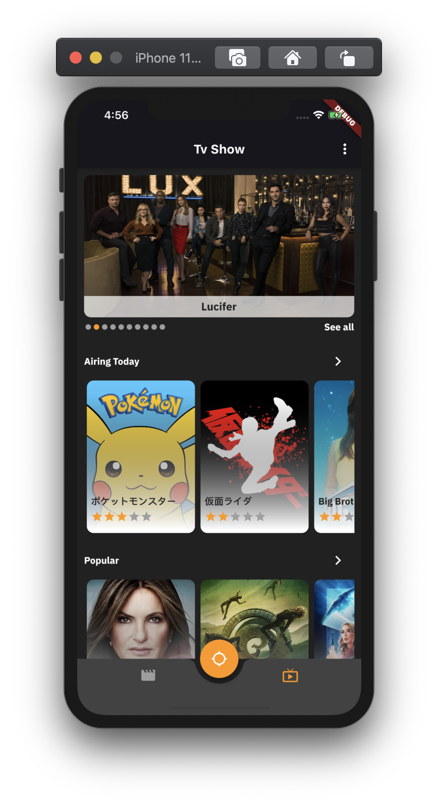     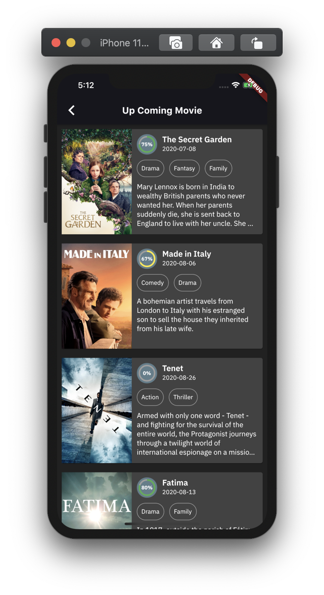     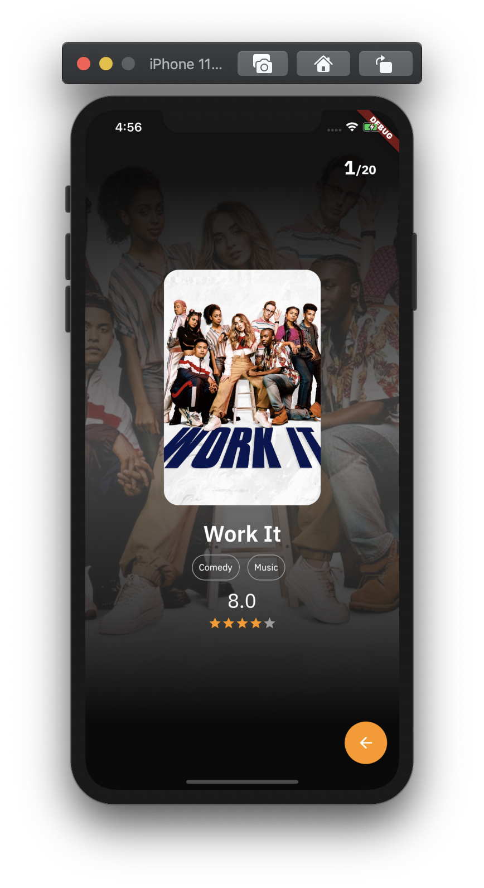     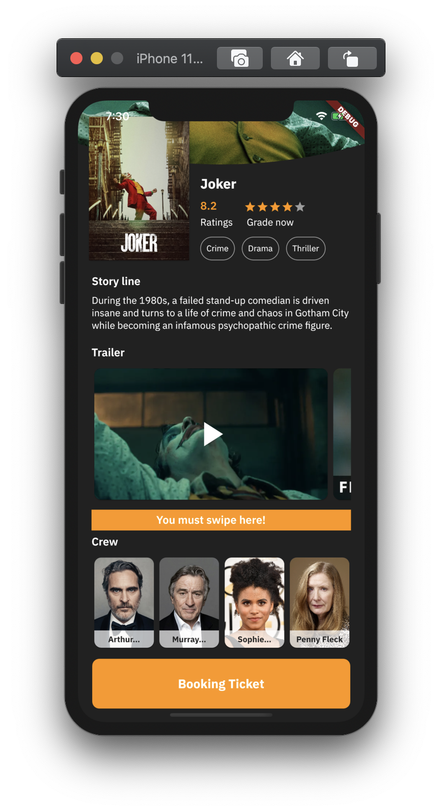     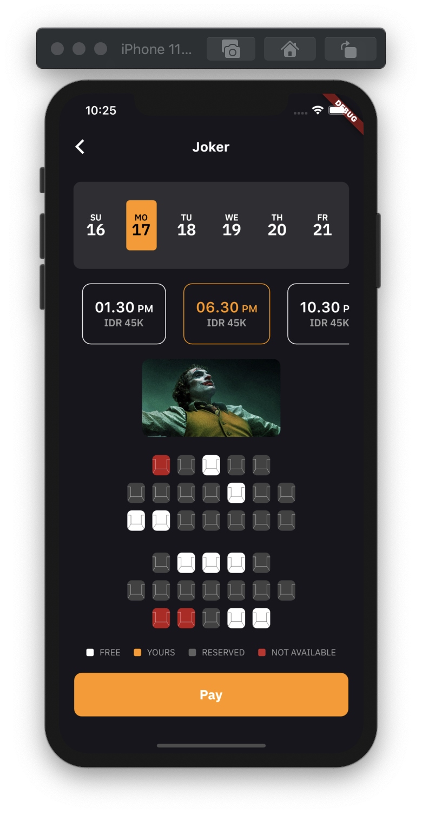     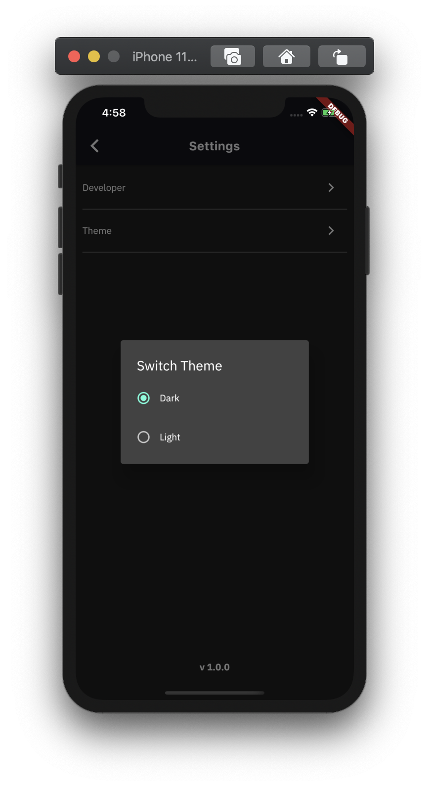     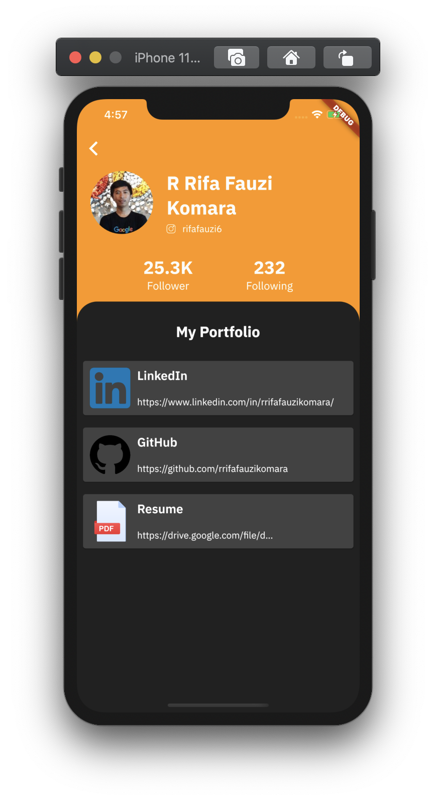     
</pre>


## 📸 Example Android
<pre>
               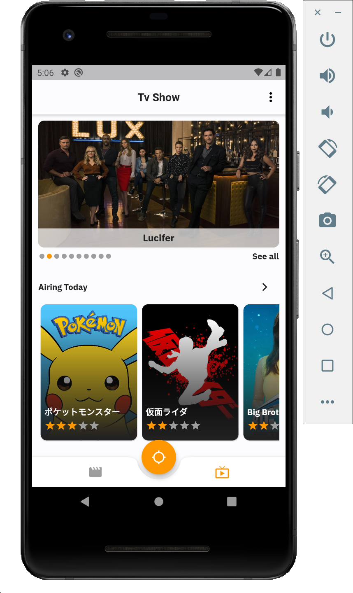     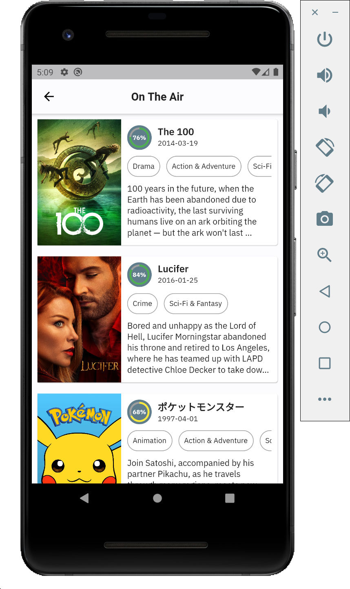     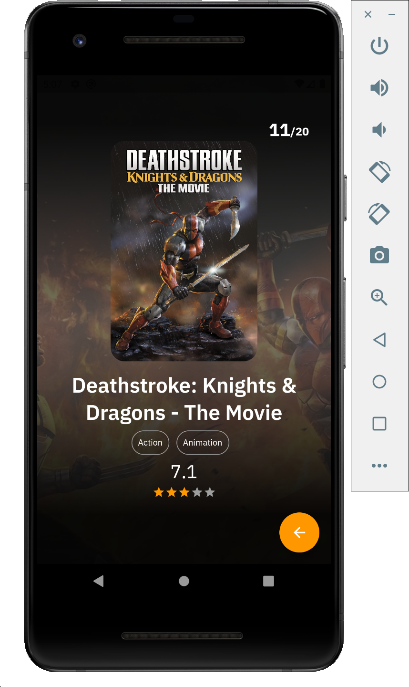     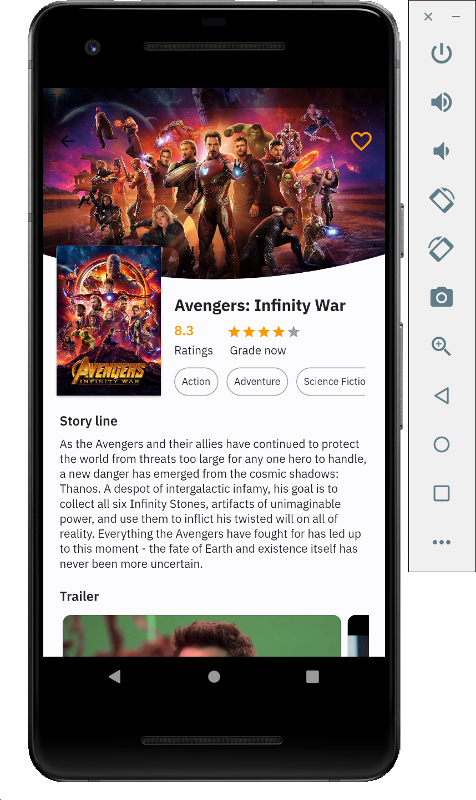          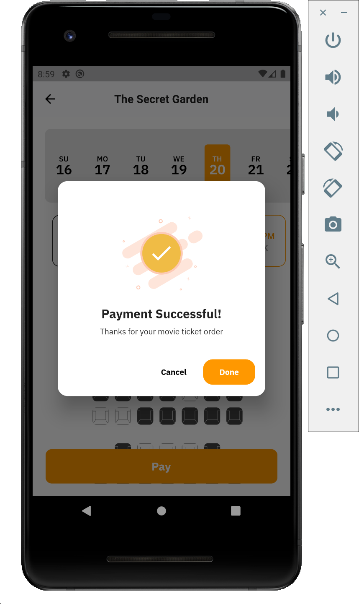          
</pre>


## Quick start
This is a normal flutter app. You should follow the instructions in the [official documentation](https://flutter.io/docs/get-started/install).
This project uses **BLoC** (business logic component) to separate the business logic with UI itself.
It's recommended to do self-study about it before jumping into the project [here](https://bloclibrary.dev/).
And also on this project uses **Modularization** approach to separate each feature ([core](https://github.com/rrifafauzikomara/MovieCatalogue/tree/master/core), [shared](https://github.com/rrifafauzikomara/MovieCatalogue/tree/master/shared), [ui](https://github.com/rrifafauzikomara/MovieCatalogue/tree/master/lib/ui) modules).
You can do self-study about it in [here](https://medium.com/flutter-community/mastering-flutter-modularization-in-several-ways-f5bced19101a).


## Modularization Structure 🔥

    # Root Project
    .
    ├── core                   # Name of module (new package)
    │   ├── bloc               # Business logic component.
    │   └── network            # Remote Data Handlers
    |       ├── api            # Retrofit API for remote end point, model using Equatable.
    |       ├── model          # Model / POJO using Equatable.
    │       └── repository     # Single source of data and for handling data from network to cache.
    |
    ├── lib                    # Name of module (default from Flutter)
    │   └── ui                 # Activity/View layer
    |
    └── shared                 # Name of module (new package)
        ├── common             # Common shared.
        │   ├── extension      # Extension methods.
        │   ├── helpers        # Custom function, extension, etc which can be used repeatedly on each method.
        │   ├── styles         # Custom style that will be used on each widget.
        │   └── utils          # Utility classes.
        └── widget             # Custom widget which can be used repeatedly.


## Built With 🛠
* [BLoC Pattern](https://bloclibrary.dev/) - Business logic component to separate the business logic with UI.
* [Equatable](https://pub.dev/packages/equatable) - Being able to compare objects in `Dart` often involves having to override the `==` operator.
* [Retrofit](https://pub.dartlang.org/packages/retrofit) with [Dio](https://github.com/flutterchina/dio/) - A type-safe HTTP client.
* [Json Serializable](https://pub.dev/packages/json_serializable) - Builders for handling JSON.
* [Shared Preferences](https://pub.dev/packages/shared_preferences) - Cache implementation approach.
* [Modularization](https://medium.com/flutter-community/mastering-flutter-modularization-in-several-ways-f5bced19101a) - Separate functionality into independent, interchangeable modules.
* [Shimmer](https://pub.dev/packages/shimmer) - Loading handler.
* [Flutter Launcher Icons](https://pub.dev/packages/flutter_launcher_icons) - Launcher icons handler.
* [Integration Testing](https://flutter.dev/docs/cookbook/testing/integration/introduction) - Automating UI/Integration Tests.
* [Flavor](https://medium.com/@animeshjain/build-flavors-in-flutter-android-and-ios-with-different-firebase-projects-per-flavor-27c5c5dac10b) - Handling different environments for development and production.
* [Codemagic](https://blog.codemagic.io/environments-in-flutter-with-codemagic-cicd/) - Handling DevOps CI/CD for pipeline and automatically build.
* Handle State - (Loading, No Data, Has Data, No Internet Connection, Request Timeout, Error)
* [Build Release for Android](https://flutter.dev/docs/deployment/android) - Available on the [Play Store](https://play.google.com/store/apps/details?id=id.rifafauzi.movie)
* [Youtube Player](https://pub.dev/packages/youtube_player_flutter) - Play Trailer Video.
* [Extension Methods](https://dart.dev/guides/language/extension-methods)
* [Pull To Refresh](https://pub.dev/packages/liquid_pull_to_refresh) - Handle Pull to Refresh the Content


## Todo
* [x] Redesign of UI
* [x] Pull To Refresh
* [ ] Play Trailer with Full Screen
* [ ] Full Animation
* [ ] Reminder with Notification
* [ ] Remove boilerplate BLoC
* [ ] Re-check Integration Testing (UI Test) Because of Redesign of UI
* [ ] Unit Testing (Mockito with BLoC)
* [ ] Add Fastlane
* [ ] Automatically publish to Google Play Store


## How to run Flutter App
Before run the app, make sure you have an emulator running, or a device connected over USB and debugging enabled on that device.
Then you need to register the `API_KEY` from www.themoviedb.org then enter the `API_KEY` into ***api_constant.dart*** file

```
static const apiKey = "HERE";
```


If you want to generate file `*.g.dart`, you can use this command on terminal. But before you running that, make sure go to [core](https://github.com/rrifafauzikomara/MovieCatalogue/tree/master/core) module first using `cd` command. For example `cd core`. Then you can run the command below.

One time build:
```console
flutter pub run build_runner build
```
or you can watch for changes and rebuild automatically
```console
flutter pub run build_runner watch
```


### Run Flutter app between Flavor for development and production with command prompt
Development
```console
flutter run --flavor development --target=lib/ui/launcher/main-dev.dart
```
Production
```console
flutter run --flavor production --target=lib/ui/launcher/main-prod.dart
```


### Run Flutter app between Flavor for development and production with 
<pre>


</pre>


## How to run the Test
### Integration Testing (will be modified, for now it's not working)
```console
flutter drive --target=test_driver/app.dart --flavor development
```


## Author

* **R Rifa Fauzi Komara**

Don't forget to follow me, fork and give me a ⭐


## License

```
MIT License

Copyright (c) [2020] [R Rifa Fauzi Komara]

Permission is hereby granted, free of charge, to any person obtaining a copy
of this software and associated documentation files (the "Software"), to deal
in the Software without restriction, including without limitation the rights
to use, copy, modify, merge, publish, distribute, sublicense, and/or sell
copies of the Software, and to permit persons to whom the Software is
furnished to do so, subject to the following conditions:

The above copyright notice and this permission notice shall be included in all
copies or substantial portions of the Software.

THE SOFTWARE IS PROVIDED "AS IS", WITHOUT WARRANTY OF ANY KIND, EXPRESS OR
IMPLIED, INCLUDING BUT NOT LIMITED TO THE WARRANTIES OF MERCHANTABILITY,
FITNESS FOR A PARTICULAR PURPOSE AND NONINFRINGEMENT. IN NO EVENT SHALL THE
AUTHORS OR COPYRIGHT HOLDERS BE LIABLE FOR ANY CLAIM, DAMAGES OR OTHER
LIABILITY, WHETHER IN AN ACTION OF CONTRACT, TORT OR OTHERWISE, ARISING FROM,
OUT OF OR IN CONNECTION WITH THE SOFTWARE OR THE USE OR OTHER DEALINGS IN THE
SOFTWARE.
```