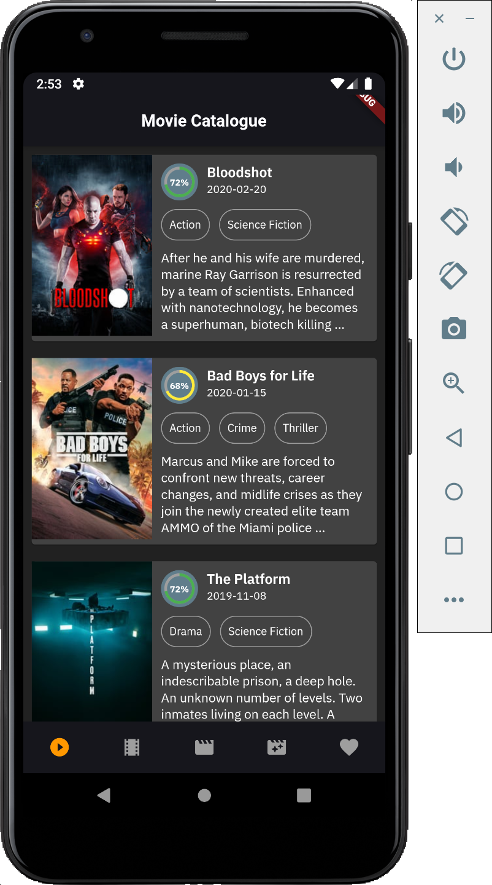
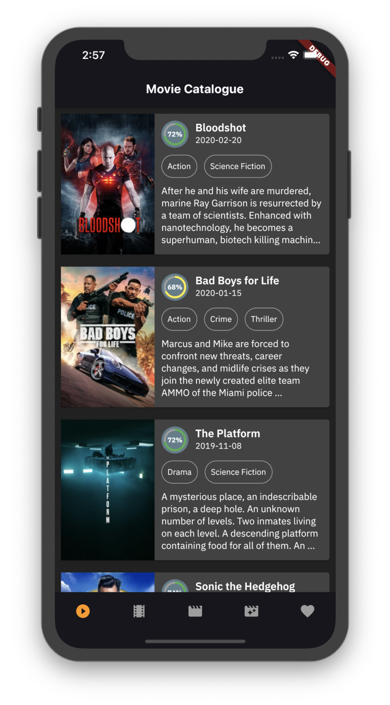

# Movie Catalogue


## Features
*  Support Dark Mode and Light Mode 🔥
*  Now Playing Movies
*  Up Coming Movies
*  Popular Movies
*  Top Rated Movies


## Screenshot
<pre>
     
</pre>


## Quick start
This is a normal flutter app. You should follow the instructions in the [official documentation](https://flutter.io/docs/get-started/install).
This project uses BLoC (business logic component) to separate the business logic with UI itself.
It's recommended to do self-study about it before jumping into the project [here](https://bloclibrary.dev/).


## About Flutter
Flutter is Google's SDK for crafting beautiful, fast user experiences for
mobile, web and desktop from a single codebase. Flutter works with existing
code, is used by developers and organizations around the world, and is free
and open source. We think Flutter will help you create beautiful, fast apps, with a productive,
extensible and open development model.


## Libraries
* [BLoC Pattern](https://bloclibrary.dev/)
* [Equatable](https://pub.dev/packages/equatable)
* [Retrofit](https://pub.dartlang.org/packages/retrofit) with [Dio](https://github.com/flutterchina/dio/)
* [Json Serializable](https://pub.dev/packages/json_serializable)
* [Build Runner](https://pub.dev/packages/build_runner)
* [Shared Preferences](https://pub.dev/packages/shared_preferences) for Cache Implementation


## Todo
* [ ] Detail Movies
* [ ] Favorite Movies (SQFlite)
* [ ] Shimmer Loading
* [ ] Unit Testing (Mockito)
* [ ] Instrumentation Testing
* [ ] Flavor on Android and iOS
* [ ] Build and Release for iOS


## How to run
To run the app, switch to that project's directory, and use `flutter run`. Make sure you have an emulator running, or a device connected over USB and debugging enabled on that device.

```console
flutter run
```

If you want to generate file `*.g.dart`, you can use this command on terminal.
One time build:
```console
flutter pub run build_runner build
```
or you can watch for changes and rebuild automatically
```console
flutter pub run build_runner watch
```


## I Want To Contribute!
Feel free to contribute or create a new pull request!


## Author

* **R Rifa Fauzi Komara**

Don't forget to follow me, fork and give me a ★
