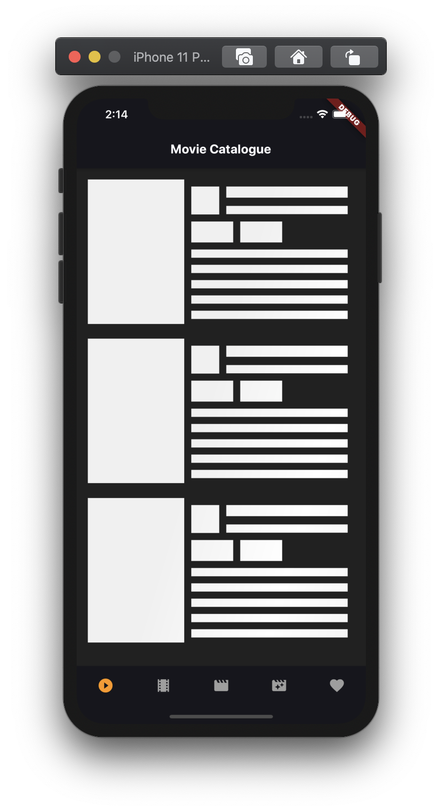
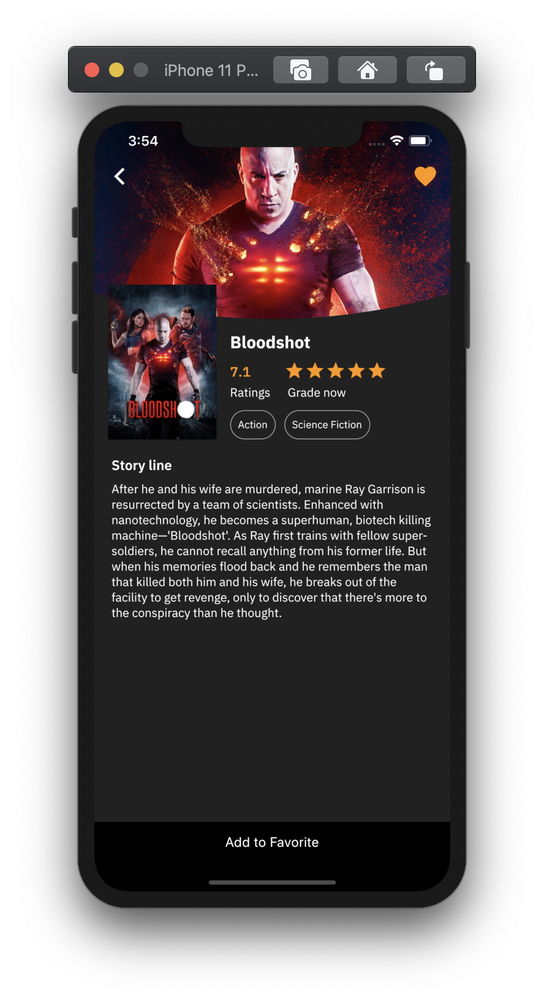
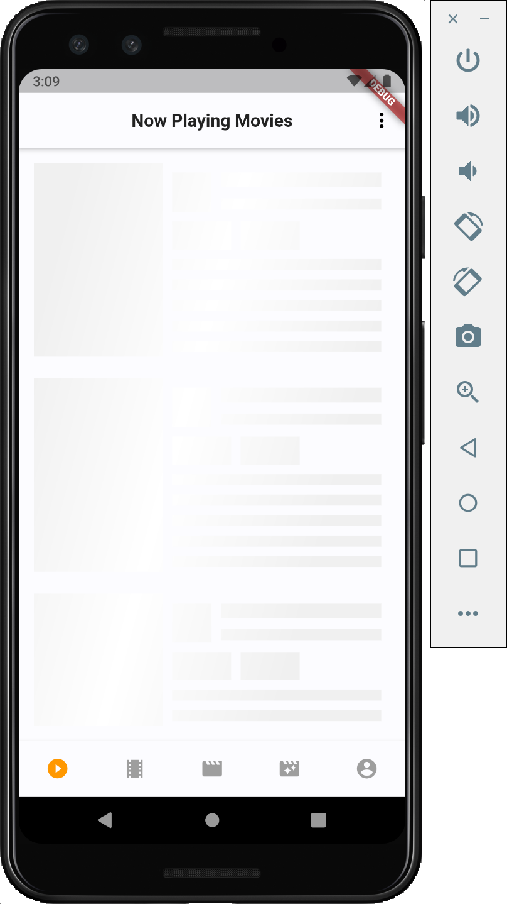
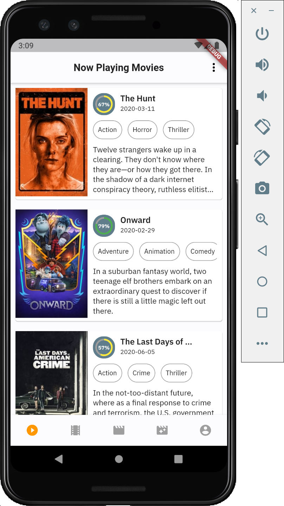

# Movie Catalogue
[](https://github.com/rrifafauzikomara/MovieCatalogue)

## Features
*  Support Dark Mode and Light Mode 🔥
*  Now Playing Movies
*  Up Coming Movies
*  Popular Movies
*  Top Rated Movies
*  Detail Movies


## Example iOS
<pre>
          
</pre>


## Example Android
<pre>
          
</pre>


## Quick start
This is a normal flutter app. You should follow the instructions in the [official documentation](https://flutter.io/docs/get-started/install).
This project uses BLoC (business logic component) to separate the business logic with UI itself.
It's recommended to do self-study about it before jumping into the project [here](https://bloclibrary.dev/).


## About Flutter
Flutter is Google's SDK for crafting beautiful, fast user experiences for
mobile, web and desktop from a single codebase. Flutter works with existing
code, is used by developers and organizations around the world, and is free
and open source. We think Flutter will help you create beautiful, fast apps, with a productive,
extensible and open development model.


## Libraries
* [BLoC Pattern](https://bloclibrary.dev/)
* [Equatable](https://pub.dev/packages/equatable)
* [Retrofit](https://pub.dartlang.org/packages/retrofit) with [Dio](https://github.com/flutterchina/dio/)
* [Json Serializable](https://pub.dev/packages/json_serializable)
* [Build Runner](https://pub.dev/packages/build_runner)
* [Shared Preferences](https://pub.dev/packages/shared_preferences) for Cache Implementation
* [Modularization](https://github.com/rrifafauzikomara/flutter_modularization) for [core](https://github.com/rrifafauzikomara/MovieCatalogue/tree/master/core) and [shared](https://github.com/rrifafauzikomara/MovieCatalogue/tree/master/shared) modules
* [Shimmer Loading](https://pub.dev/packages/shimmer)
* [Flutter Launcher Icons](https://pub.dev/packages/flutter_launcher_icons)
* [Flavor](https://medium.com/@animeshjain/build-flavors-in-flutter-android-and-ios-with-different-firebase-projects-per-flavor-27c5c5dac10b) on Android and iOS (development and production)


## Todo
* [ ] Favorite Movies (SQFlite)
* [ ] Unit Testing (Mockito)
* [ ] Instrumentation Testing
* [ ] Build and Release for iOS


## How to run Flutter App
Before run the app, make sure you have an emulator running, or a device connected over USB and debugging enabled on that device.
Then you need to register the `API_KEY` from www.themoviedb.org then enter the `API_KEY` into ***api_constant.dart*** file

```
static const apiKey = "HERE";
```


If you want to generate file `*.g.dart`, you can use this command on terminal. But before you running that, make sure go to [core](https://github.com/rrifafauzikomara/MovieCatalogue/tree/master/core) module first using `cd` command. For example `cd core`. Then you can run the command below.

One time build:
```console
flutter pub run build_runner build
```
or you can watch for changes and rebuild automatically
```console
flutter pub run build_runner watch
```


### Run Flutter App between Flavor for development and production with command prompt
Development
```console
flutter run --flavor development --target=lib/ui/launcher/main-dev.dart
```
Production
```console
flutter run --flavor production --target=lib/ui/launcher/main-prod.dart
```


### Run Flutter App between Flavor for development and production with 
<pre>


</pre>


## Author

* **R Rifa Fauzi Komara**

Don't forget to follow me, fork and give me a ★